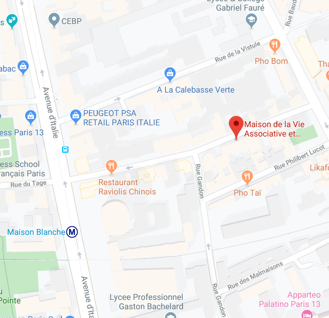

# Club de lecture Citoyens pour le Climat

Environ une fois par mois, le collectif [Citoyens pour le
Climat](https://citoyenspourleclimat.org/) organise un club de lecture
scientifique. Tout le monde peut assister aux séances.

## Comment ça marche ?

1. Le pôle sciences choisit un article paru récemment dans la littérature
   scientifique dans un des domaines sur lesquels se basent nos actions
   (climatologie, énergie, économie, biodiversité, …).

2. Nous lisons l'article en détail et préparons une liste de questions ou de
   points de discussion sur un pad public en avance.

3. Nous invitons les auteurs de l'article à venir échanger avec nous et
   répondre à nos questions lors de la séance du club de lecture. Les sessions
   durent une heure. Les auteurs sont invités à venir soit avec quelques slides
   de présentation (déjà préparées pour une autre conférence, pour éviter du
   travail supplémentaire) pour faire un bref récapitulatif de leurs travaux,
   soit à venir uniquement pour échanger et répondre à nos questions.

## Objectifs

- Maintenir le pôle science informé des dernières avancées dans la littérature
  scientifique ;
- Assurer une cohérence entre le discours de l'association et le consensus
  scientifique ;
- Créer des liens avec des chercheurs actifs dans les domaines de nos actions
  qui seraient intéressés pour guider davantage notre discours.

## Planning

### Mercredi 15 janvier 2020

* **Intervenants :**
  [Adrien Fabre](https://www.parisschoolofeconomics.eu/en/fabre-adrien/) et
  [Thomas Douenne](https://www.parisschoolofeconomics.eu/en/douenne-thomas/)
* **Date :** mercredi 15 janvier 2020
* **Heure :** 19h30 - 20h30
* **Lieu :** Maison de la Vie Associative et Citoyenne du 13e
* **Salle :** Salle Rouge A

Merci de noter vos questions sur le pad :
<https://etherpad.wikimedia.org/p/cplc-reading-club-2020-01-15>

[Can We Reconcile French People with the Carbon Tax? Disentangling Beliefs from
Preferences](http://faere.fr/pub/PolicyPapers/Douenne_Fabre_FAERE_PP2019.05.pdf)

> Using a new survey and National households' survey data, we investigate
> French perception over carbon taxation. We find that French people largely
> reject a tax and dividend policy where revenues of the tax would be
> redistributed uniformly. However, their perception about the properties of
> the tax are biased: people overestimate the negative impact on their
> purchasing power, wrongly think the scheme is regressive, and do not perceive
> it as environmentally effective. Our econometric analysis shows that
> correcting these three bias would suffice to generate majority acceptance.
> Yet, we find that people's beliefs are persistent and their revisions biased
> towards pessimism, so that only few can be convinced.

[French Attitudes over Climate Change and Climate
Policies](http://faere.fr/pub/PolicyPapers/Douenne_Fabre_FAERE_PP2019.06.pdf)

> This paper aims to assess the prospects for French climate policies after the
> Yellow Vests crisis halted the planned increase in the carbon tax. From a
> large representative survey, we elicit knowledge, perceptions and values over
> climate change, we examine opinions relative to carbon taxation, and we
> assess support for other climate policies. Specific attention is given to the
> link between perceptions of climate change and attitudes towards policies.
> The paper also studies in details the determinants of attitudes in terms of
> political and socio-demographic variables. Among many results, we find
> limited knowledge but high concern for climate change. We also document a
> large rejection of the carbon tax but majority support for stricter norms and
> green investments, and reveal the rationales behind these preferences. Our
> study entails policy recommendations, such as an information campaign on
> climate change. Indeed, we find that climate awareness increases support for
> climate policies but no evidence for the formation of opinions through
> partisan cues as in the US, suggesting that better access to science could
> foster support for the ecology.

## Informations pratiques

### Assister à distance

Il est possible d'assister au club de lecture à distance sur Google Meet, à
l'adresse suivante : <https://meet.google.com/xcx-dajj-ybx>.

### Assister sur place

Le club de lecture est organisé à la Maison de la Vie Associative et Citoyenne
du 13e arrondissement, situé à l'adresse suivante :

**Maison de la Vie Associative et Citoyenne du 13e**  
*11 rue Caillaux*  
*75013 Paris*  
*France*

